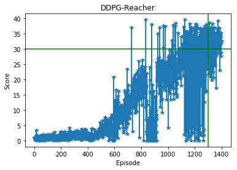

### Enironment
A double jointed arm and a subspace represnts the goal. The objective is to maintain the end effector in contact with the goal as long as possible. A reward of 0.1 is given each time step both are in contact. The environment is offered in two versions namley one agent and 20 agents. The observation vector size is 33 per agent and the action space dimension is 4 per agent.
The problem is considered to be solved when the mean of rewards over 100 consecutive episodes is larger than 30.
### DDPG
DDPG stands for deep determenstic policy gradient. DDPG is an off-policy method meaning that the target policy is different from the behavioral policy. It tries to learn Q function(critic) and a policy(actor). The policy is parameterized functoin reperesented by a nueral network that maps a state to a specific action(hence the name determenestic). The critic predicts how good is the choice of action a taken in state s. A copy of actor/critic networks representing the Target networks which are used as error measure to improve the stability of the learning process. The imporvment of the stability of the learning process is a result of the slow change expereniced by the target networks from the soft update of the weights. 
The learning algorithm assumes independent samples from the environment, therefore, to ensure an uncorrelated experinces, a replay buffer is used to store Transitions(state, action, reward, next_state, terminal(bool)). When learning a batch is uniformly sampled from the buffer. 
To overcome the exploration problem, a noise added to the policy function. The noise comes from the Ornstein-Uhlenbeck process[[1](https://en.wikipedia.org/wiki/Ornstein%E2%80%93Uhlenbeck_process)].
Refrences:
[DDPG paper](https://arxiv.org/pdf/1509.02971.pdf)
[Target networks intuition](https://stackoverflow.com/questions/54237327/why-is-a-target-network-required/54238556#54238556)
##### Algorithm
- Initialize the actor/critic networks weights 
- Hard copy the weights to the target networks weights
- Initialize the replay buffer
- for each episode:
    * Initialize the random process for action exploration
    * Receive initial observation state
    * for each time-step:
        * select an action according to the current policy and exploration noise
        * exceute the action and observe the transition
        * store the transition(state, action, reward, next_state, terminal(bool))
        * sample a random mini-batch of N transition from the replay buffer
        * set y = reward + gamma * target Q value function in state s' (next state) given action a chosen from the actor function.
        * update the critic by minimizing the loss L = 1/N sum of (y - the Q value function in state s given action a)
        * update the actor policy using the sampled policy gradient
        * sofe update the target networks
        
Refrences:
[DDPG paper](https://arxiv.org/pdf/1509.02971.pdf)
#####  Networks
* Actor
    |   | Layer | In  | Out |
    |---|------|-----|-----|
    | 1 | FC1  | 33  | 400 |
    | 2 | ReLU | 400 | 400 |
    | 2 | FC2  | 400 | 300 |
    | 3 | ReLU | 300 | 300 |
    | 4 | FC3  | 300 | 4   |
    | 5 | tanh | 4   | 4   |

* Critic

    |   | Layer | In    | Out |
    |---|------|-------|-----|
    | 1 | FC1  | 33    | 400 |
    | 2 | ReLU | 400   | 400 |
    | 2 | FC2  | 400+4 | 300 |
    | 3 | ReLU | 300   | 300 |
    | 4 | FC3  | 300   | 1   |

##### Hyperparmeters
* Networks:
    * Initilization:
        The FC3 weights in all nets are initialized from a uniform distribution with bounds (-0.003, 0.003)
    * Hidden layers units:
        Fc1 units: 400, Fc2 units: 300 
* Replay buffer:
    Buffer size: 200,000
    learn after: 10,000 transitions
* Training:
    Episodes: 2000 (or till the environment is solved)
    Steps per episode: 300,000
    Critic learning rate: 0.003
    Actor learning rate: 0.003
    Gamma (discount factor): 0.99
    Tau (Interpolation factor): 0.0005
    Batch size: 256
    Update every: 20
###### Result (one agent)

1400 episodes needed to solve the environment.   

###### Future work
* Try the following:
    * DDPG with 20 Agents
    * A2C   
    * A3C
